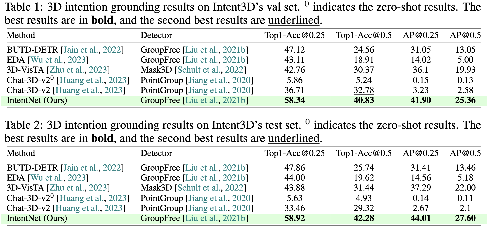

# Intent3D: 3D Object Detection in RGB-D Scans Based on Human Intention (ICLR2025)

Project Webpage:
https://weitaikang.github.io/Intent3D-webpage/

Paper:
https://arxiv.org/abs/2405.18295

<figure>
<p align="center" >

</p>
<align><em>
We introduce 3D intention grounding (right), a new task for detecting the object of interest using a 3D bounding box in a 3D scene, guided by human intention expressed in text (e.g., <em>"I want something to support my back to relieve the pressure"</em>). In contrast, the existing 3D visual grounding (left) relies on human reasoning and references for detection. The illustration clearly distinguishes that observation and reasoning are manually executed by human (left) and automated by AI (right).
</em></align>
</figure>


## 0. Installation

+ **(1)** Install environment with `environment.yml` file:
  ```
  conda env create -f environment.yml --name Intent3D
  ```
  + or you can install manually:
    ```
    conda create -n Intent3D python=3.7
    conda activate Intent3D
    conda install pytorch==1.9.0 torchvision==0.10.0 cudatoolkit=11.1 -c pytorch -c nvidia
    pip install numpy ipython psutil traitlets transformers termcolor ipdb scipy tensorboardX h5py wandb plyfile tabulate
    ```
+ **(2)** Install spacy for text parsing
  ```
  pip install spacy
  # 3.3.0
  pip install https://github.com/explosion/spacy-models/releases/download/en_core_web_sm-3.3.0/en_core_web_sm-3.3.0.tar.gz
  ```
+ **(3)** Compile pointnet++
  ```
  cd ~/Intent3D
  sh init.sh
  ```

## 1. Data preparation

The final required files are as follows:
```
├── [DATA_ROOT]
│	├── [1] train_v3scans.pkl # Packaged ScanNet training set
│	├── [2] val_v3scans.pkl   # Packaged ScanNet validation set
│	├── [3] intention_sentence/   # annotation
│	├── [4] group_free_pred_bboxes/  # detected boxes
│	├── [5] gf_detector_l6o256.pth   # pointnet++ checkpoint
```

+ **[1] [2] Prepare ScanNet Point Clouds Data**
  + **1)** Download ScanNet v2 data. Follow the [ScanNet instructions](https://github.com/ScanNet/ScanNet) to apply for dataset permission, and you will get the official download script `download-scannet.py`. Then use the following command to download the necessary files:
    ```
    python2 download-scannet.py -o [SCANNET_PATH] --type _vh_clean_2.ply
    python2 download-scannet.py -o [SCANNET_PATH] --type _vh_clean_2.labels.ply
    python2 download-scannet.py -o [SCANNET_PATH] --type .aggregation.json
    python2 download-scannet.py -o [SCANNET_PATH] --type _vh_clean_2.0.010000.segs.json
    python2 download-scannet.py -o [SCANNET_PATH] --type .txt
    ```
    where `[SCANNET_PATH]` is the output folder. The scannet dataset structure should look like below:
    ```
    ├── [SCANNET_PATH]
    │   ├── scans
    │   │   ├── scene0000_00
    │   │   │   ├── scene0000_00.txt
    │   │   │   ├── scene0000_00.aggregation.json
    │   │   │   ├── scene0000_00_vh_clean_2.ply
    │   │   │   ├── scene0000_00_vh_clean_2.labels.ply
    │   │   │   ├── scene0000_00_vh_clean_2.0.010000.segs.json
    │   │   ├── scene.......
    ```
  + **2)** Package the above files into two .pkl files(`train_v3scans.pkl` and `val_v3scans.pkl`):
    ```
    python Pack_scan_files.py --scannet_data [SCANNET_PATH] --data_root [DATA_ROOT]
    ```
+ **[3] intention_sentence**: Download Intent3D annotations from [HERE](https://drive.google.com/drive/folders/1qcXQXngRVmDtAOOOa_2mhZ-ZOkP_XuDp?usp=sharing).
+ **[4] group_free_pred_bboxes**: Download [object detector's outputs](https://1drv.ms/u/s!AsnjK0KGPk10gYBjpUjJm7TkADS8vg?e=1AXJdR).
+ **[5] gf_detector_l6o256.pth**: Download PointNet++ [checkpoint](https://1drv.ms/u/s!AsnjK0KGPk10gYBXZWDnWle7SvCNBg?e=SNyUK8).

## 2. Training

+ Please specify the paths of `--data_root`, `--log_dir`, `--tensorboard`, and `--pp_checkpoint` in the `train_scanintend` script first. We use four A6000 GPUs for training with a batch size of 24 by default.
  ```
  sh scripts/train_scanintend.sh
  ```

## 3. Evaluation

+ To evaluate on the validation set, please specify the paths of `--data_root`, `--log_dir`, `--tensorboard`, `--pp_checkpoint`, and `checkpoint_path` in the `test_scanintend` script first.
  ```
  sh scripts/test_scanintend.sh
  ```
+ Change `--eval_val` to `--eval_test` for evaluation on the test set.

## 4. Benchmark

<figure>
<p align="center" >

</p>
</figure>

## 5. Acknowledgements

We are quite grateful for [BUTD-DETR](https://github.com/nickgkan/butd_detr) and [EDA](https://github.com/yanmin-wu/EDA), which are works on <em>3D Visual Grounding</em>.
Our codebase is inherited from [EDA](https://github.com/yanmin-wu/EDA), which is inherited from [BUTD-DETR](https://github.com/nickgkan/butd_detr). If you come across issues that seem unrelated to <em>3D Intention Grounding</em> task itself, checking the corresponding parts of [EDA](https://github.com/yanmin-wu/EDA) or [BUTD-DETR](https://github.com/nickgkan/butd_detr) might sometimes be helpful. 🤔

## 6. Citation

If you find our work useful in your research, please consider citing:
```
@article{kang2024intent3d,
  title={Intent3D: 3D Object Detection in RGB-D Scans Based on Human Intention},
  author={Kang, Weitai and Qu, Mengxue and Kini, Jyoti and Wei, Yunchao and Shah, Mubarak and Yan, Yan},
  journal={arXiv preprint arXiv:2405.18295},
  year={2024}
}
```

## 7. Contact

If you have any question about this project, please feel free to contact [Weitai Kang](https://weitaikang.github.io/): k13711752197[AT]gmail.com
