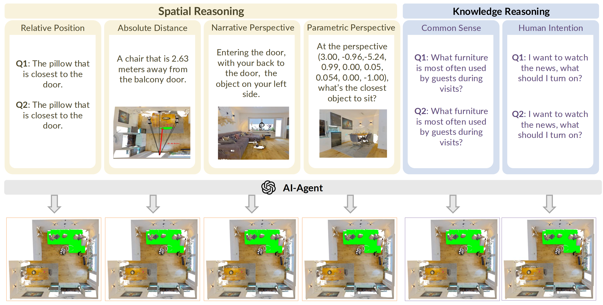
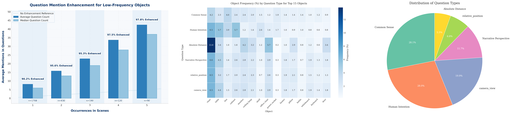

<h2><a href="https://arxiv.org/abs/your_arxiv_id">Surprise3D: A Dataset for Spatial Understanding and Reasoning in Complex 3D Scenes</a></h2>
Jiaxin Huang, Ziwen Li, Hanlue Zhang
 
MBZUAI

    

We introduce **Surprise3D**, a novel dataset designed to evaluate **language-guided spatial reasoning segmentation** in complex 3D scenes. Unlike existing datasets that often mix semantic cues (e.g., object names) with spatial context, **Surprise3D** emphasizes **spatial reasoning** by crafting queries that exclude object names, thus mitigating shortcut biases.

The dataset includes:
- **200k+ vision-language pairs** across **900+ indoor scenes** from **ScanNet++**.
- **89k+ human-annotated spatial queries** that focus on spatial relationships without object names.
- **2.8k unique object classes**, providing rich diversity for spatial reasoning tasks.

Surprise3D covers a wide range of **spatial reasoning skills**, including:
- **Relative position** (e.g., "Find the object behind the chair."),
- **Narrative perspective** (e.g., "Locate the object visible from the sofa."),
- **Parametric perspective** (e.g., "Select the object 2 meters to the left of the table."),
- **Absolute distance reasoning** (e.g., "Identify the object exactly 3 meters in front of you.").

---
## 🔍 Data Analysis

    

We provide a detailed analysis of the dataset:
1. **Distribution of Question Types**: Visualizing the proportion of questions across various reasoning categories.
2. **Augmentation for Low-Frequency Objects**: Boosting the number of questions targeting rarely occurring objects to improve model robustness.
3. **Object Frequency (%) by Question Type (Top 15 Objects)**: Examining how frequently the top 15 objects are referenced across different question types.

Our dataset ensures a balanced distribution of reasoning types and incorporates augmentation techniques to reduce biases caused by object frequency disparities. This analysis supports the development of models that generalize better across diverse reasoning tasks.

---

We modified the code obtained from [Intent3D](https://github.com/WeitaiKang/Intent3D) and [Reason3D](https://github.com/KuanchihHuang/Reason3D) to support running on our proposed dataset, we thank their dedicated efforts in their impressives works. You may find modified versions [here](./Models). 
